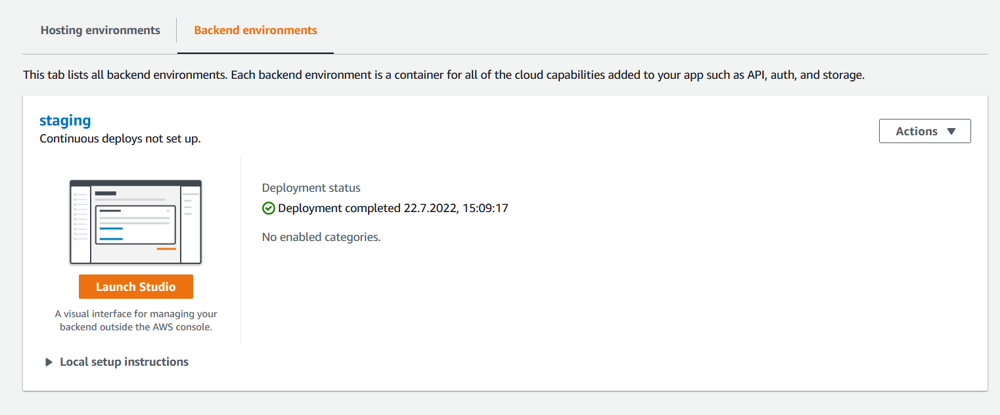

# amplify-boilerplate

The below README holds some extracts and links of the **[AWS Amplify Documentation](https://docs.amplify.aws/)**. In case more information is needed, you will likely find it there.

## Pre-requisites
* [**Amplify pre-requisites for a React project**](https://docs.amplify.aws/start/getting-started/installation/q/integration/react/#option-1-watch-the-video-guide)

Install AWS Amplify CLI with ```npm install -g @aws-amplify/cli```

**Concerning AWS Account Creation**: 
*For the registration, go to [AWS Portal Developer Registration](https://portal.aws.amazon.com/gp/aws/developer/registration). The **first year is free**, then the cost depend on the usage.*

I used **Ionic with React** in this boilerplate project. I checked out React Native as well, but the support for ReactJS (and hence Ionic with React) in AWS Amplify seemed to me a bit better.

### Ionic Framework Installation
Using Ionic is not a must, but it allows you to create a **native & Progressive Web App (PWA)** in one. To get started with Ionic check out the [**official Ionic website**](https://ionicframework.com/). 
(And don't let yourself hinder from the need to create an account - it is worth it :))

## Getting started

The best way to try out AWS Amplify yourself is with the [**AWS Amplify Sandbox**](https://sandbox.amplifyapp.com/getting-started).

* **[Give team members access](https://docs.amplify.aws/console/adminui/access-management/)**

### Workflow
There are **two ways**, you can make changes in your app:
* In the **AWS Amplify Studio** you can develop your app backend graphically (to a certain extent) & add a UI library (with Figma components).
* With the **Amplify CLI and a local code repository** you can develop your frontend and your backend further.

#### AWS Amplify Studio 

Amplify Studio is a graphical interface for your AWS Amplify backend that can be opened by clicking **Launch Studio** in AWS Amplify console:



Whenever you do a change in Amplify Studio, you should update your local code repository with ``amplify pull`` or ``
amplify pull --appId <your-app-id> --envName staging`` to get the latest changes.

#### Git-based Deployments
When configured as described [**here**](https://docs.amplify.aws/guides/hosting/git-based-deployments/q/platform/js/), the code gets **automatically deployed** when pushed to the **Master/Main branch** on Git.
You can observe the deployment in the AWS console under AWS Amplify.

## Basic Development

### Figma Integration

* Get started with this **[tutorial](https://docs.amplify.aws/console/tutorial/buildui/#create-ui-components-in-figma)**. More details are provided [**here**](https://docs.amplify.aws/console/uibuilder/figmatocode/#step-1-set-up-figma-file).
* Check out the **[best practices](https://docs.amplify.aws/console/uibuilder/bestpractices/)** for Figma to code.
* You may create [**UI component collections**](https://docs.amplify.aws/console/tutorial/collections/) (e.g. a grid with profile cards) and directly link them to the database!

**Tip:** As mentioned in best practices, the font of Figma components is not automatically taken over into the code component. To use the desired font you need to import it.

### Use an Amplify Datastore

* Get started with this **[tutorial](https://docs.amplify.aws/lib/datastore/getting-started/q/platform/js/#option-2-use-amplify-cli)**

The easiest way is to create the [**data model**](https://docs.amplify.aws/console/tutorial/data/#browse-and-auto-generate-your-app-data) inside Amplify Studio.
More details about data modeling are provided [**here**](https://docs.amplify.aws/console/data/data-model/).
After pulling the changes with ``amplify pull`` use the following command to configure the database locally:
```
# For existing APIs
amplify update api
```
Then follow the rest of the tutorial linked above.

* You can use Amplify Studio to **[add default data to the database](https://docs.amplify.aws/console/data/content-management/)**.
* [**Manipulate the data**](https://docs.amplify.aws/lib/datastore/data-access/q/platform/js/#create-and-update) through the **DataStore** object. **Tip**: The *Predicates* class is available in the same library as DataStore.

### Create a Python API

* Get started with this [**tutorial**](https://docs.amplify.aws/guides/api-rest/python-api/q/platform/js/#3-updating-the-function-code)

Checkout the inbuilt [**Predictions API**](https://docs.amplify.aws/lib/predictions/intro/q/platform/js/) to see what **AI & ML cloud services** AWS Amplify already provides.
